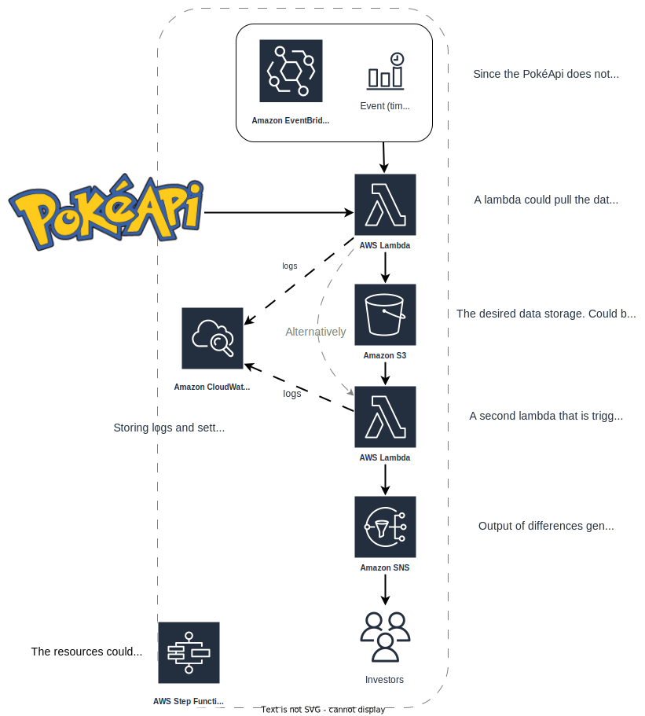

# gotta-process-em-all

This repository contains resources for a case study. There is code and notes for pulling, and processing data form the PokéAPI.

## Scope for the tasks

Pokémon that appear in `red`, `blue`, `leafgreen` or `white` are in scope.

The following fields are required:
- id
- name (titlecase)
- height
- weight
- base_experience
- order
- default_front sprite
- bmi (needs to be calculated)


## Pull data about Pokémon from specific games

After looking at the documentation for the API, I concluded that, unfortunately, it is not possible to fetch all Pokémon in a given game with a specific endpoint or query parameter or anything similar. I came up with the following approaches:

**Approach 1:** Fetch all Pokémon by paginating through the Pokémon endpoint, then filter the results using the field `game_indices.[].version.name`. Paginating through all Pokémon is not sufficient though, because the data returned are just names and url references to the actual data of a Pokémon. 

**Approach 2:** Fetch the game data and through relationships the Pokémon they contain. This requires chaining requests for the following resources: game > version_group > generation > pokemon_species > pokemon. Upon fetching and inspecting some of the data I determined that this approach will not work. Unfortunately Pokémon species != Pokémon. The species contain all the available varieties of it, however, it is not guaranteed that every variety appeared in the 4 given games, so another check needs to be performed to make sure the data is correct.

While exploring the endpoints of the Rest API I noticed that a GraphQL API is also available. Since the Rest API had no support for query parameters and filtering data I took a look since this sounded like something that would lend itself well to a GraphQL query.

**Approach 3:** Using the Graph API. With the help of the API explorer I put toghether a query that gives me the list of Pokémon with the desired fields within the scope. This is the most efficient way of obtaining the data from PokéAPI, because it puts the filtering duties on their end, reduces the room for error on my end (given the query is correct) and the size of the returned data is optimal, since I only get the fields I want.

After experimenting with approaches 1 and 3 I was able to fetch 667 Pokémon in the given games. This is what a raw record looks like (see [dump](pokemon_gql_raw.json) for more):

```JSON
{
  "id": 1,
  "height": 7,
  "name": "bulbasaur",
  "order": 1,
  "base_experience": 64,
  "weight": 69,
  "pokemon_v2_pokemontypes": [
    {
      "slot": 1,
      "pokemon_v2_type": {
        "name": "grass"
      }
    },
    {
      "slot": 2,
      "pokemon_v2_type": {
        "name": "poison"
      }
    }
  ],
  "pokemon_v2_pokemonsprites": [
      {
        "sprites": "{\"front_default\": \"/media/sprites/pokemon/1.png\"}"
      }
  ]
} 
```

## Processing the data

> There is an issue with the sprites in the Graph API data. See https://github.com/PokeAPI/pokeapi/issues/614#issuecomment-1422636938

I decided to flatten the data and store records as json objects.

I dumped all records in to a json file named `pokemon_processed.json`. The data could be sorted into multiple files of course, but I think this depends on the use case. Depending on the purpose or the database they could be saved as independent json files, in batch by games or by Pokémon type even. 

If the data is expected to be updated it should be also considered as a factor in separating the records into files. If all the data is dumped into 1 file it represents the "state" of the Pokémon data in scope. This can be versioned and updated or just overwritten as needed. If the data is separated into files additional logic may be required to determine what files need to be updated to avoid unnecessary operations.

Record after processing (see [processed records](pokemon_processed.json) for more (not formatted)):

```JSON
{
  "id": 1,
  "name": "Bulbasaur",
  "height": 7,
  "weight": 69,
  "base_experience": 64,
  "order": 1,
  "type": [
    "grass",
    "poison"
  ],
  "bmi": 14.08,
  "default_front_sprite": "https://raw.githubusercontent.com/PokeAPI/sprites/master/sprites/pokemon/1.png"
}
```

## Bonus Requirements
### Pseudonymize Pokémon data

First let's identify the fields that make the data indentifiable. One could argue that if the attributes like weight or height are static, then the combination of the fields could always be used to indenfy a Pokémon. For the sake of this excercise let's put this argument aside and treat Pokémon as they were individuals where their attributes are not traceable.

Fields with identifiable data in my opinion are: id, name and default_front_sprite. The latter because it contains the id.

I chose to apply symmetric encryption (Fernet) on the fields with identifiable data. I implemented a function for encrypting relevant fields and one for decrypting them.

> This is technically overkill if the goal is to only pseudonymise. The encryption step could be skipped, but in that case the `id` and `default_front_sprite` fields must be removed and the pseudonym lookup has to be stored in a private and secure database.

To create the pseudonyms I used Faker, a python library for fake data generation to generate human readable names for the Pokémon. I store the mappings in a file, but in this implementation this is not sensitive as it is just a mapping between the pseudonym and the encrypted value. This version should now allow data analysis while the data is not identifiable to any Pokémon.

To see if the output of the decryption function is correct I put in print statements that compare the two lists, and also used `diff` which showed that the processed data matched the decrypted data.

### Continuous updates to investors

To build a system that releases updates about Pokémon to investors I came up with the following arcitecture in AWS. I wasn't sure if the updates to provide are the raw data or a diff-like message about the changes like "Charizard: height: 17 > 18", but the architecture should work in multiple interpretations with some tweaks.



### Dashboard

### Spark compability

Python and the json format the processed data is stored in should be both Spark compatible.

```sh
>>> df = spark.read.json("pokemon_processed.json")
>>> df.show()
+---------------+-----+--------------------+------+---+----------+-----+----------------+------+
|base_experience|  bmi|default_front_sprite|height| id|      name|order|            type|weight|
+---------------+-----+--------------------+------+---+----------+-----+----------------+------+
|             64|14.08|https://raw.githu...|     7|  1| Bulbasaur|    1| [grass, poison]|    69|
|            142| 13.0|https://raw.githu...|    10|  2|   Ivysaur|    2| [grass, poison]|   130|
|            263| 25.0|https://raw.githu...|    20|  3|  Venusaur|    3| [grass, poison]|  1000|
|             62|23.61|https://raw.githu...|     6|  4|Charmander|    5|          [fire]|    85|
|            142| 15.7|https://raw.githu...|    11|  5|Charmeleon|    6|          [fire]|   190|
|            267|31.31|https://raw.githu...|    17|  6| Charizard|    7|  [fire, flying]|   905|
|             63| 36.0|https://raw.githu...|     5|  7|  Squirtle|   10|         [water]|    90|
|            142| 22.5|https://raw.githu...|    10|  8| Wartortle|   11|         [water]|   225|
|            265| 33.4|https://raw.githu...|    16|  9| Blastoise|   12|         [water]|   855|
|             39|32.22|https://raw.githu...|     3| 10|  Caterpie|   14|           [bug]|    29|
|             72| 20.2|https://raw.githu...|     7| 11|   Metapod|   15|           [bug]|    99|
|            198|26.45|https://raw.githu...|    11| 12|Butterfree|   16|   [bug, flying]|   320|
|             39|35.56|https://raw.githu...|     3| 13|    Weedle|   17|   [bug, poison]|    32|
|             72|27.78|https://raw.githu...|     6| 14|    Kakuna|   18|   [bug, poison]|   100|
|            178| 29.5|https://raw.githu...|    10| 15|  Beedrill|   19|   [bug, poison]|   295|
|             50| 20.0|https://raw.githu...|     3| 16|    Pidgey|   21|[normal, flying]|    18|
|            122|24.79|https://raw.githu...|    11| 17| Pidgeotto|   22|[normal, flying]|   300|
|            216|17.56|https://raw.githu...|    15| 18|   Pidgeot|   23|[normal, flying]|   395|
|             51|38.89|https://raw.githu...|     3| 19|   Rattata|   25|        [normal]|    35|
|            145|37.76|https://raw.githu...|     7| 20|  Raticate|   27|        [normal]|   185|
+---------------+-----+--------------------+------+---+----------+-----+----------------+------+
only showing top 20 rows
```