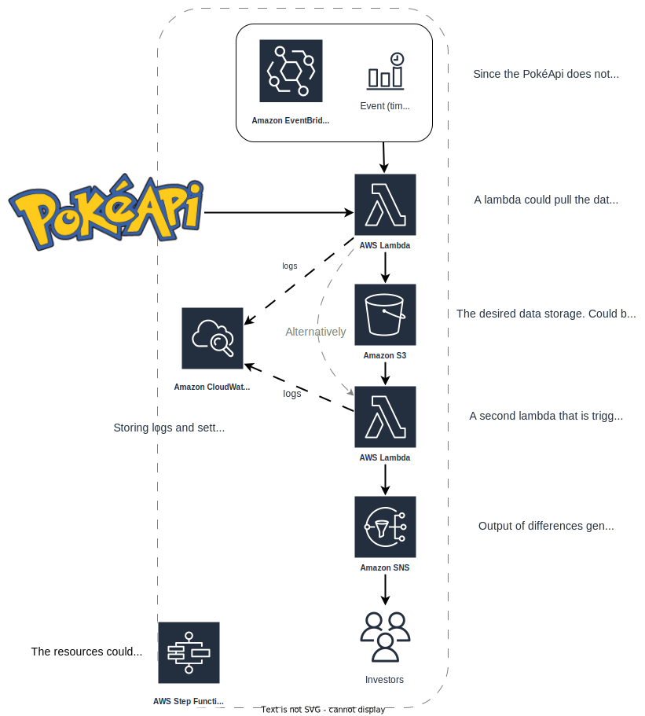
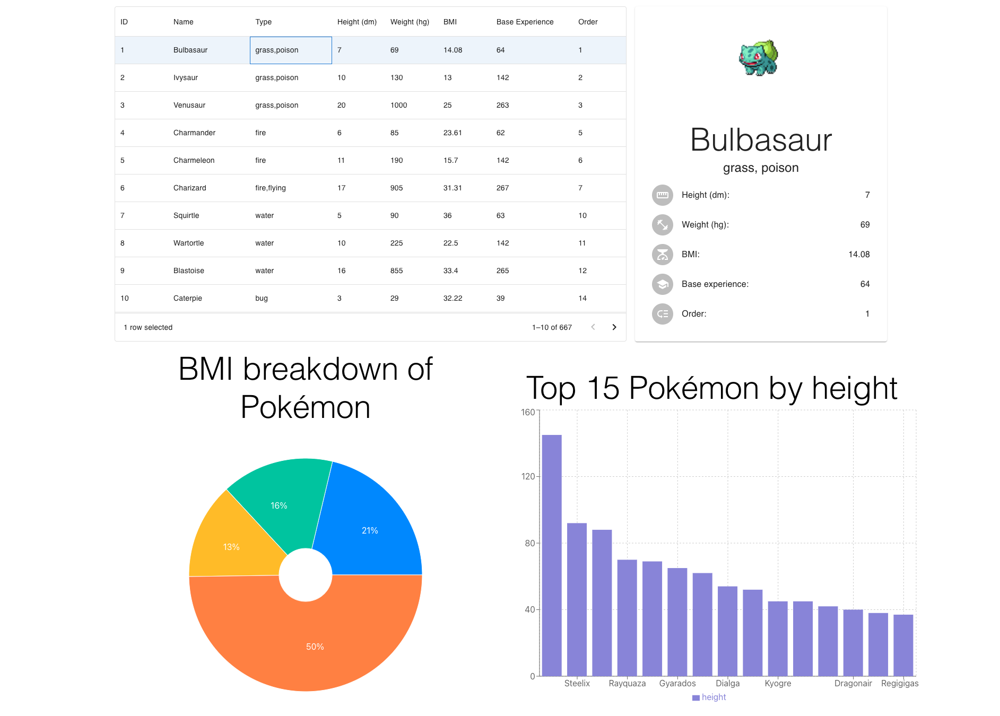

# **Gotta process 'em all**

### Case study about Pokémon

---

# Fetching the data

Planning ways to obtain the data:
- Using the Rest API to get **all** Pokémon ✅
    Fetching `/pokemon`
- Using the Rest API to get the game data and work to Pokémon ❌
    Fetching `version` and walk through `version > version_group > generation > pokemon_species > pokemon`
- Using the Graph API to get a filtered list of Pokémon ✅ 🏆
    Fetching only Pokémon in scope with relevant data

---

# Processing the data

I chose to store the records as flattened JSON objects. For calculating the BMI I had to convert the weight and height to kg and m. I also had to account for a data issue in the Graph API response.
```JSON
{
  "id": 1,
  "name": "Bulbasaur",
  "height": 7,
  "weight": 69,
  "base_experience": 64,
  "order": 1,
  "type": [
    "grass",
    "poison"
  ],
  "bmi": 14.08,
  "front_default_sprite": "https://raw.githubusercontent.com/PokeAPI/sprites/master/sprites/pokemon/1.png"
}
```

---

# Storing data

I ended up storing the data in **1** json file.

I think the json format is universal enough to prove useful to all parties that would have to interact with the data.

The records were all placed into 1 file to represent the current state of the creatures, this can be versioned.

However, records can be easily broken up into files based on database and customer requirements (e.g.: separating Pokémon based on game).


---

# Pseudonymising Pokémon

First I identified the fields that could be PII. I determined these to be: `id`, `name` and `front_default_sprite`.

For pseudonymising I used the Faker python library to generate names and stored the mapping between the pseudonym and real name in a Python dictionary that should be stored securely in a prod environment. 

`id` and `front_default_sprite` can be removed.

I also implemented the encryption of sensitive fields. This way all fields can be provided (although they will not be useful) and the pseudonym - name table can be stored with less precautions.

---

# Pseudonymised data example

```JSON
{
  "name": "Pocket Monster 710190",
  "height": 7,
  "weight": 69,
  "base_experience": 64,
  "order": 1,
  "type": [
    "grass",
    "poison"
  ],
  "bmi": 14.08
}
```

---

# Continous updates



For delivering updates I came up with the architecture on the left.

This delivers diff-like messages `Charizard: height: 17 > 18`, but the delivered message is completely up to the 2nd Lambda.

---

# Dashboard

[](https://sandormatyas.github.io/gotta-process-em-all)

I put together a small dashboard to interact with Pokémon in React.

---

# Spark


```sh
>>> df = spark.read.json("data/pokemon_processed.json")
>>> df.limit(10).show()
+---------------+-----+--------------------+------+---+----------+-----+---------------+------+
|base_experience|  bmi|front_default_sprite|height| id|      name|order|           type|weight|
+---------------+-----+--------------------+------+---+----------+-----+---------------+------+
|             64|14.08|https://raw.githu...|     7|  1| Bulbasaur|    1|[grass, poison]|    69|
|            142| 13.0|https://raw.githu...|    10|  2|   Ivysaur|    2|[grass, poison]|   130|
|            263| 25.0|https://raw.githu...|    20|  3|  Venusaur|    3|[grass, poison]|  1000|
|             62|23.61|https://raw.githu...|     6|  4|Charmander|    5|         [fire]|    85|
|            142| 15.7|https://raw.githu...|    11|  5|Charmeleon|    6|         [fire]|   190|
|            267|31.31|https://raw.githu...|    17|  6| Charizard|    7| [fire, flying]|   905|
|             63| 36.0|https://raw.githu...|     5|  7|  Squirtle|   10|        [water]|    90|
|            142| 22.5|https://raw.githu...|    10|  8| Wartortle|   11|        [water]|   225|
|            265| 33.4|https://raw.githu...|    16|  9| Blastoise|   12|        [water]|   855|
|             39|32.22|https://raw.githu...|     3| 10|  Caterpie|   14|          [bug]|    29|
+---------------+-----+--------------------+------+---+----------+-----+---------------+------+
```
